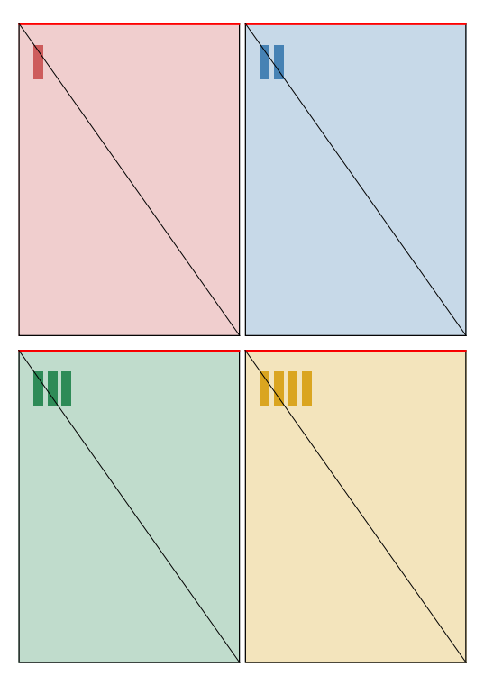
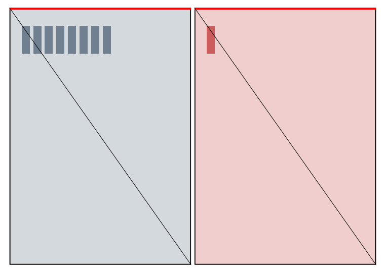
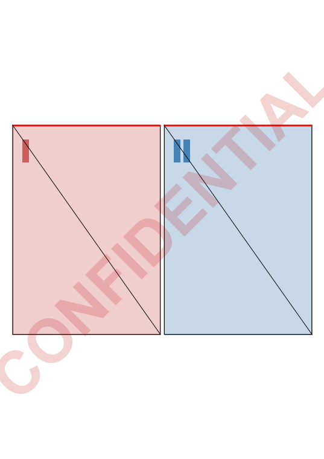

<div align="center">


# Open-LeanPrint

**Pool your print jobs, put several pages on one sheet, and print the result —
without installing a print driver.**

An open-source alternative to FinePrint that runs natively on Windows on ARM.

[](https://github.com/azitc-ac/Open-LeanPrint/actions/workflows/ci.yml)
[](LICENSE)

</div>

Open-LeanPrint is a Windows tool for getting more onto less paper. It collects
the documents you print, arranges several pages per sheet or reorders them into a
foldable booklet, shows you the result before anything reaches paper, and forwards
it to a real printer.

Unlike the established tools of its kind it installs **no print driver at all**.
It registers a printer that Windows drives with its own in-box IPP class driver,
pointed at a local service. That is what lets it work on Windows on ARM, where
third-party x64 print drivers are not emulated — and what keeps it working as
Microsoft retires the driver category.

## Why another print tool?

FinePrint and its kind install a **virtual printer driver**. Microsoft is
phasing that whole category out: Windows Protected Print only permits the in-box
IPP class driver, and on Windows on ARM, x64 print drivers are not emulated at
all. So Open-LeanPrint ships no driver. It registers a local printer that
Windows drives with its **own** IPP class driver, pointed at a loopback service —
driverless, ARM64-native, and future-proof by construction. The reasoning in
full: [docs/ARCHITECTURE.md](docs/ARCHITECTURE.md).

## What it does

| | |
|---|---|
|  | **N-up imposition.** 1, 2, 4, 9 … pages per sheet, any rows × columns, with margins, gutters and automatic rotation. Four pages here on one A4 sheet. |
|  | **Booklets.** Saddle-stitch ordering for fold-and-staple booklets — sheet one carries pages 8 and 1, as it must. Pair it with short-edge duplex and the printer does the rest. |
|  | **Watermarks.** Text across every sheet, sized to the paper, in the colour and opacity you choose. |

Plus:

- **Pool several jobs** onto shared sheets — three short memos become one 4-up
  sheet, not three.
- **Drop or turn pages** before printing — type a range, or right-click a page
  in the preview to remove or rotate it.
- **Page borders** — a thin frame around each page, so four pages on a sheet
  read as four pages rather than one crowded one.
- **Save layouts as profiles** and pick them again later.
- **Duplex**, including the short-edge flip that booklets need.
- **Colour goes through.** The virtual printer does not print, it hands the
  document to one that does, so it keeps colour rather than flattening it to grey
  on the way in.
- **Live WYSIWYG preview** that re-imposes as you change anything.
- **Print and close** — printing ends the job: the pool empties and the window
  goes away, while collecting carries on in the tray. Or **save** the imposed PDF
  instead.
- **Hands-free mode** — every job you print gets imposed and printed
  automatically, no window needed.

## Getting started

Grab the installer from the [latest release](https://github.com/azitc-ac/Open-LeanPrint/releases/latest)
and run it. It installs the app **and creates the virtual printer**, so there is
nothing else to do: print to *Open-LeanPrint* from any application and the job
lands in the pool, ready to be imposed.

You can also just open PDFs directly — drop them on the window, pick a layout,
hit Print.

### Privacy

Open-LeanPrint collects nothing and sends nothing — no telemetry, no update
check, no server. It does handle your documents, because that is what it is for:
[PRIVACY.md](PRIVACY.md) says exactly where they go and how long they stay.

### Code signing

Free code signing is provided by [SignPath.io](https://signpath.io/), with a
certificate from the [SignPath Foundation](https://signpath.org/). The installers
are built by [a GitHub Actions workflow](.github/workflows/release.yml) from the
tagged commit and signed from there, so a package can be traced back to the
source it came from.

> **While that certificate is being arranged**, releases carry a self-signed one
> instead. Windows will not recognise it until you say it should — the release
> notes explain the one command that does it. A self-signed certificate
> establishes that the files came from the same place, not who that place is;
> the point of the Foundation certificate is to remove that step.

Running from source instead:

```powershell
dotnet run --project src/OpenLeanPrint.App
```

It offers to add the printer on first start, just like the installed copy —
answer yes and confirm the Windows prompt. Full walkthrough:
[docs/USER-GUIDE.md](docs/USER-GUIDE.md).

## Command line

Everything the app does is scriptable:

```powershell
openleanprint impose report.pdf out.pdf --nup 2x2 --paper A4 --margin 8 --gutter 6
openleanprint impose report.pdf book.pdf --booklet --pages 1-16
openleanprint print out.pdf --printer "Brother MFC-9332CDW Printer" --duplex short
openleanprint watch --nup 2x2 --printer "Brother MFC-9332CDW Printer"   # hands-free
```

`watch` is the one that changes your day: print from any application, and a
4-up sheet comes out of the printer.

## Building

Requires only the [.NET 8 SDK](https://dotnet.microsoft.com/download).

```bash
dotnet test                              # engine, capture, composition, printing
dotnet build OpenLeanPrint.Windows.sln   # everything, including the desktop app
```

The imposition engine and the capture service build and run on Linux and macOS
too; printing and the app are Windows-only and marked as such. To produce
something copyable — one self-contained executable, or an installable MSIX:

```powershell
.\scripts\New-SigningCertificate.ps1                              # once
.\scripts\Build-Installer.ps1 -CertificateSubject "CN=Your Name"  # .msi installer
.\scripts\Build-Msix.ps1 -CertificateSubject "CN=Your Name"       # .msix, app only
.\scripts\Publish-App.ps1                                         # one loose .exe
```

The **.msi** is the one to hand to someone else: it installs to Program Files,
creates the virtual printer, adds a Start-menu entry and starts Open-LeanPrint at
login. An .msix cannot create the printer — MSIX forbids install-time scripts —
so there the app asks once instead.

## Project layout

| Path | What |
|---|---|
| `src/OpenLeanPrint.Core` | Domain model and imposition engine. Platform-neutral, heavily tested. |
| `src/OpenLeanPrint.Capture` | Loopback IPP service, IPP codec, captured-folder watching. |
| `src/OpenLeanPrint.Capture.Host` | Console host that receives and stores print jobs. |
| `src/OpenLeanPrint.Compose` | Imposed sheets → output PDF, including watermarks. |
| `src/OpenLeanPrint.Print` | Output PDF → Windows printer (PDFium raster + spooler). |
| `src/OpenLeanPrint.App` | The WPF desktop app. |
| `src/OpenLeanPrint.Cli` | `openleanprint`: impose, print, watch, list-printers, sample. |
| `docs/` | Architecture, user guide, and a record of how each part was verified. |

## Status

Capture, imposition, printing, the desktop app and packaging all work and are
verified on Windows 11 ARM64. A Windows service holds the loopback port, so the
printer works from system start, with nobody logged in and with no window open.
163 automated tests; CI builds and tests on Linux and Windows.

See [docs/ROADMAP.md](docs/ROADMAP.md) for what each milestone delivered and what
is still open.

## Contributing

Contributions are welcome — see [CONTRIBUTING.md](CONTRIBUTING.md). The
imposition engine is the stable, well-tested core; printer compatibility reports
are especially useful, since every driver has its own opinions.

## Licence

[MIT](LICENSE) © Alexander Zarenko.

PDF rendering uses [PDFium](https://pdfium.googlesource.com/pdfium/) (BSD) via
[PDFtoImage](https://github.com/sungaila/PDFtoImage) (MIT), composition uses
[PdfSharpCore](https://github.com/ststeiger/PdfSharpCore) (MIT) and parsing uses
[PdfPig](https://github.com/UglyToad/PdfPig) (Apache-2.0). Ghostscript and MuPDF
are AGPL and are deliberately avoided so Open-LeanPrint can stay permissive.
